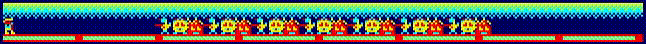
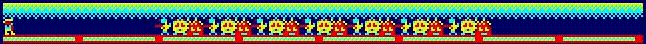
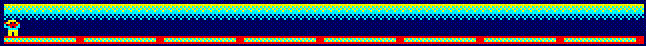

Here you can find some software coded in machine code, for testing this code you can copy it and paste it in the memory map of the processor system. If you use WinAPE emulator, you can open the debug window (F7) and paste the code from address 0x4000. Remember to set the program counter of the processor to this address in order to execute the code before close the debug window.

This is a code for printing a simple tile, this can be used for printing a ground:
```
21 00 C0 36 FF 26 C8 36 A5 26 D0 36 5A 26 D8 36 FF 18 FE
```

This is a code for printing a ground using the previous code for a tile:
```
21 00 C0 3E 50 36 FF 26 C8 36 A5 26 D0 36 5A 26 D8 36 A5 26 E0 36 FF 26 C0 2C 3D 20 E8 18 FE
```

This is a code for printing a ground and a sky:
```
21 00 C0 3E 50 36 F0 26 C8 36 5A 26 D0 36 A5 26 D8 36 1E 26 E0 36 0F 26 E8 36 0A 26 F0 36 05 26 F8 36 08 26 C0 2C 3D 20 DC 3E 50 2E 50 36 00 26 C8 36 00 26 D0 36 00 26 D8 36 00 26 E0 36 00 26 E8 36 00 26 F0 36 00 26 F8 36 00 26 C0 2C 3D 20 DC 3E 50 2E A0 36 FF 26 C8 36 A5 26 D0 36 5A 26 D8 36 FF 26 C0 2C 3D 20 EC C3 00 40
```

This is a code for printing a cowboy (8x8 pixels):

- Here the cowboy without firing:
```
21 50 C0 36 70 2C 36 80 26 C8 36 00 2D 36 D5 26 D0 36 77 2C 36 08 26 D8 36 88 2D 36 05 26 E0 36 07 2C 36 88 26 E8 36 88 2D 36 70 26 F0 36 40 2C 36 80 26 F8 36 C0 2D 36 60 18 FE
```
- Here the cowboy firing:
```
21 50 C0 36 70 2C 36 80 26 C8 36 00 2D 36 D5 26 D0 36 77 2C 36 08 26 D8 36 7F 2D 36 05 26 E0 36 06 2C 36 04 26 E8 36 80 2D 36 70 26 F0 36 40 2C 36 80 26 F8 36 C0 2D 36 60 18 FE
```

- Here the cowboy celebrating victory:
```
21 50 C0 36 30 2C 36 C0 26 C8 36 B9 2D 36 E8 26 D0 36 3B 2C 36 EF 26 D8 36 47 2D 36 1F 26 E0 36 03 2C 36 0E 26 E8 36 E0 2D 36 30 26 F0 36 30 2C 36 60 26 F8 36 60 2D 36 30 10 FE
```

This is a code for printing some enemies (8x8 pixels):

- Here the enemy 1:
```
21 9E C0 36 23 2C 36 0C 26 C8 36 48 2D 36 01 26 D0 36 00 2C 36 41 26 D8 36 F0 2D 36 FF 26 E0 36 10 2C 36 E8 26 E8 36 C0 2D 36 00 26 F0 36 00 2C 36 0C 26 F8 36 02 2D 36 01 18 FE
```

- Here the enemy 2:
```
21 9E C0 36 23 2C 36 AE 26 C8 36 E1 2D 36 34 26 D0 36 71 2C 36 F4 26 D8 36 F6 2D 36 73 26 E0 36 70 2C 36 F0 26 E8 36 BC 2D 36 61 26 F0 36 30 2C 36 E0 26 F8 36 03 2D 36 06 18 FE
```

- Here the enemy 3:
```
21 9E C0 36 80 2C 36 80 26 C8 36 EC 2D 36 50 26 D0 36 F5 2C 36 D4 26 D8 36 EE 2D 36 77 26 E0 36 F5 2C 36 FB 26 E8 36 F9 2D 36 74 26 F0 36 FF 2C 36 FF 26 F8 36 3F 2D 36 EF 18 FE
```

This is a code for printing an animated explosion (4x4 pixels):
```
21 9F D8 36 66 26 E0 36 66 06 32 76 05 20 FC 26 D0 36 99 26 D8 36 64 26 E0 36 26 26 E8 36 99 06 32 76 05 20 FC 36 91 26 E0 36 24 26 D8 36 42 26 D0 36 98 06 32 76 05 20 FC 36 81 26 D8 36 04 26 E0 36 02 26 E8 36 18 06 32 76 05 20 FC 36 01 26 E0 36 00 26 D8 36 00 26 D0 36 08 06 32 76 05 20 FC 36 00 26 E8 36 00 18 FE
```

And this for printing an animated great explosion (8x8 pixels):
```
21 9E C8 36 66 26 D0 36 66 26 E8 36 66 26 F0 36 66 2C 26 C8 36 66 26 D0 36 66 26 E8 36 66 26 F0 36 66 06 32 76 05 20 FC 26 C0 36 99 26 C8 36 64 26 D0 36 26 26 D8 36 99 26 E0 36 99 26 E8 36 64 26 F0 36 26 26 F8 36 99 2D 26 C0 36 99 26 C8 36 64 26 D0 36 26 26 D8 36 99 26 E0 36 99 26 E8 36 64 26 F0 36 26 26 F8 36 99 06 32 76 05 20 FC 36 91 26 F0 36 24 26 E8 36 42 26 E0 36 98 26 D8 36 91 26 D0 36 24 26 C8 36 42 26 C0 36 98 2C 26 F8 36 91 26 F0 36 24 26 E8 36 42 26 E0 36 98 26 D8 36 91 26 D0 36 24 26 C8 36 42 26 C0 36 98 06 32 76 05 20 FC 36 81 26 C8 36 04 26 D0 36 02 26 D8 36 18 26 E0 36 81 26 E8 36 04 26 F0 36 02 26 F8 36 18 2D 26 C0 36 81 26 C8 36 04 26 D0 36 02 26 D8 36 18 26 E0 36 81 26 E8 36 04 26 F0 36 02 26 F8 36 18 06 32 76 05 20 FC 36 01 26 F0 36 00 26 E8 36 00 26 E0 36 08 26 D8 36 01 26 D0 36 00 26 C8 36 00 26 C0 36 08 2C 26 F8 36 01 26 F0 36 00 26 E8 36 00 26 E0 36 08 26 D8 36 01 26 D0 36 00 26 C8 36 00 26 C0 36 08 06 32 76 05 20 FC 36 00 26 D8 36 00 26 E0 36 00 26 F8 36 00 2D 26 C0 36 00 26 D8 36 00 26 E0 36 00 26 F8 36 00 18 FE
```

This is an animation of a cowboy shooting an enemy:
```
21 00 C0 3E 50 36 F0 26 C8 36 5A 26 D0 36 A5 26 D8 36 1E 26 E0 36 0F 26 E8 36 0A 26 F0 36 05 26 F8 36 08 26 C0 2C 3D 20 DC 3E 50 2E 50 36 00 26 C8 36 00 26 D0 36 00 26 D8 36 00 26 E0 36 00 26 E8 36 00 26 F0 36 00 26 F8 36 00 26 C0 2C 3D 20 DC 3E 50 2E A0 36 FF 26 C8 36 A5 26 D0 36 5A 26 D8 36 FF 26 C0 2C 3D 20 EC 21 9E C0 36 23 2C 36 0C 26 C8 36 48 2D 36 01 26 D0 36 00 2C 36 41 26 D8 36 F0 2D 36 FF 26 E0 36 10 2C 36 E8 26 E8 36 C0 2D 36 00 26 F0 36 00 2C 36 0C 26 F8 36 02 2D 36 01 21 50 C0 36 70 2C 36 80 26 C8 36 00 2D 36 D5 26 D0 36 77 2C 36 08 26 D8 36 88 2D 36 05 26 E0 36 07 2C 36 88 26 E8 36 88 2D 36 70 26 F0 36 40 2C 36 80 26 F8 36 C0 2D 36 60 06 64 76 05 20 FC 21 51 D8 36 7F 2D 26 E0 36 06 2C 36 04 26 E8 36 80 06 0A 76 05 20 FC 3E 4D 21 52 D8 36 F0 06 0A 76 05 20 FC 36 00 2C 3D 20 F2 21 9E C8 36 66 26 D0 36 66 26 E8 36 66 26 F0 36 66 2C 26 C8 36 66 26 D0 36 66 26 E8 36 66 26 F0 36 66 06 32 76 05 20 FC 26 C0 36 99 26 C8 36 64 26 D0 36 26 26 D8 36 99 26 E0 36 99 26 E8 36 64 26 F0 36 26 26 F8 36 99 2D 26 C0 36 99 26 C8 36 64 26 D0 36 26 26 D8 36 99 26 E0 36 99 26 E8 36 64 26 F0 36 26 26 F8 36 99 06 32 76 05 20 FC 36 91 26 F0 36 24 26 E8 36 42 26 E0 36 98 26 D8 36 91 26 D0 36 24 26 C8 36 42 26 C0 36 98 2C 26 F8 36 91 26 F0 36 24 26 E8 36 42 26 E0 36 98 26 D8 36 91 26 D0 36 24 26 C8 36 42 26 C0 36 98 06 32 76 05 20 FC 36 81 26 C8 36 04 26 D0 36 02 26 D8 36 18 26 E0 36 81 26 E8 36 04 26 F0 36 02 26 F8 36 18 2D 26 C0 36 81 26 C8 36 04 26 D0 36 02 26 D8 36 18 26 E0 36 81 26 E8 36 04 26 F0 36 02 26 F8 36 18 06 32 76 05 20 FC 36 01 26 F0 36 00 26 E8 36 00 26 E0 36 08 26 D8 36 01 26 D0 36 00 26 C8 36 00 26 C0 36 08 2C 26 F8 36 01 26 F0 36 00 26 E8 36 00 26 E0 36 08 26 D8 36 01 26 D0 36 00 26 C8 36 00 26 C0 36 08 06 32 76 05 20 FC 36 00 26 D8 36 00 26 E0 36 00 26 F8 36 00 2D 26 C0 36 00 26 D8 36 00 26 E0 36 00 26 F8 36 00 C3 00 40
```

Here is the code of a cowboy with a group of enemies:
```
21 00 C0 3E 50 36 F0 26 C8 36 5A 26 D0 36 A5 26 D8 36 1E 26 E0 36 0F 26 E8 36 0A 26 F0 36 05 26 F8 36 08 26 C0 2C 3D 20 DC 3E 50 2E 50 36 00 26 C8 36 00 26 D0 36 00 26 D8 36 00 26 E0 36 00 26 E8 36 00 26 F0 36 00 26 F8 36 00 26 C0 2C 3D 20 DC 2E A0 3E 08 06 09 36 FF 26 C8 36 A5 26 D0 36 5A 26 D8 36 FF 26 C0 2C 05 20 EC 36 FF 26 C8 36 FF 26 D0 36 FF 26 D8 36 FF 26 C0 2C 3D C2 55 40 21 50 C0 36 70 2C 36 80 26 C8 36 00 2D 36 D5 26 D0 36 77 2C 36 08 26 D8 36 88 2D 36 05 26 E0 36 07 2C 36 88 26 E8 36 88 2D 36 70 26 F0 36 40 2C 36 80 26 F8 36 C0 2D 36 60 3E 07 21 63 C0 36 23 2C 36 0C 26 C8 36 48 2D 36 01 26 D0 36 00 2C 36 41 26 D8 36 F0 2D 36 FF 26 E0 36 10 2C 36 E8 26 E8 36 C0 2D 36 00 26 F0 36 00 2C 36 0C 26 F8 36 02 2D 36 01 2C 2C 26 C0 36 23 2C 36 AE 26 C8 36 E1 2D 36 34 26 D0 36 71 2C 36 F4 26 D8 36 F6 2D 36 73 26 E0 36 70 2C 36 F0 26 E8 36 BC 2D 36 61 26 F0 36 30 2C 36 E0 26 F8 36 03 2D 36 06 2C 2C 26 C0 36 80 2C 36 80 26 C8 36 EC 2D 36 50 26 D0 36 F5 2C 36 D4 26 D8 36 EE 2D 36 77 26 E0 36 F5 2C 36 FB 26 E8 36 F9 2D 36 74 26 F0 36 FF 2C 36 FF 26 F8 36 3F 2D 36 EF 2C 2C 26 C0 3D C2 BE 40 18 FE
```

Here is the same, but the enemies are moving towards the cowboy:
```
0E 63 16 12 21 00 C0 3E 50 36 F0 26 C8 36 5A 26 D0 36 A5 26 D8 36 1E 26 E0 36 0F 26 E8 36 0A 26 F0 36 05 26 F8 36 08 26 C0 2C 3D 20 DC 3E 50 2E 50 36 00 26 C8 36 00 26 D0 36 00 26 D8 36 00 26 E0 36 00 26 E8 36 00 26 F0 36 00 26 F8 36 00 26 C0 2C 3D 20 DC 2E A0 3E 08 06 09 36 FF 26 C8 36 A5 26 D0 36 5A 26 D8 36 FF 26 C0 2C 05 20 EC 36 FF 26 C8 36 FF 26 D0 36 FF 26 D8 36 FF 26 C0 2C 3D C2 59 40 21 50 C0 36 70 2C 36 80 26 C8 36 00 2D 36 D5 26 D0 36 77 2C 36 08 26 D8 36 88 2D 36 05 26 E0 36 07 2C 36 88 26 E8 36 88 2D 36 70 26 F0 36 40 2C 36 80 26 F8 36 C0 2D 36 60 69 26 C0 3E 07 36 23 2C 36 0C 26 C8 36 48 2D 36 01 26 D0 36 00 2C 36 41 26 D8 36 F0 2D 36 FF 26 E0 36 10 2C 36 E8 26 E8 36 C0 2D 36 00 26 F0 36 00 2C 36 0C 26 F8 36 02 2D 36 01 2C 2C 26 C0 36 23 2C 36 AE 26 C8 36 E1 2D 36 34 26 D0 36 71 2C 36 F4 26 D8 36 F6 2D 36 73 26 E0 36 70 2C 36 F0 26 E8 36 BC 2D 36 61 26 F0 36 30 2C 36 E0 26 F8 36 03 2D 36 06 2C 2C 26 C0 36 80 2C 36 80 26 C8 36 EC 2D 36 50 26 D0 36 F5 2C 36 D4 26 D8 36 EE 2D 36 77 26 E0 36 F5 2C 36 FB 26 E8 36 F9 2D 36 74 26 F0 36 FF 2C 36 FF 26 F8 36 3F 2D 36 EF 2C 2C 26 C0 3D C2 C2 40 06 4B 76 76 05 20 FB 0D 15 C2 04 40 C3 00 40
```
This is the preview:



This is the code of an animation where the cowboy is firing the group of enemies and he destroys them in one shoot:
```
21 00 C0 3E 50 36 F0 26 C8 36 5A 26 D0 36 A5 26 D8 36 1E 26 E0 36 0F 26 E8 36 0A 26 F0 36 05 26 F8 36 08 26 C0 2C 3D 20 DC 3E 50 2E 50 36 00 26 C8 36 00 26 D0 36 00 26 D8 36 00 26 E0 36 00 26 E8 36 00 26 F0 36 00 26 F8 36 00 26 C0 2C 3D 20 DC 2E A0 3E 08 06 09 36 FF 26 C8 36 A5 26 D0 36 5A 26 D8 36 FF 26 C0 2C 05 20 EC 36 FF 26 C8 36 FF 26 D0 36 FF 26 D8 36 FF 26 C0 2C 3D C2 55 40 21 50 C0 36 70 2C 36 80 26 C8 36 00 2D 36 D5 26 D0 36 77 2C 36 08 26 D8 36 88 2D 36 05 26 E0 36 07 2C 36 88 26 E8 36 88 2D 36 70 26 F0 36 40 2C 36 80 26 F8 36 C0 2D 36 60 3E 07 21 63 C0 36 23 2C 36 0C 26 C8 36 48 2D 36 01 26 D0 36 00 2C 36 41 26 D8 36 F0 2D 36 FF 26 E0 36 10 2C 36 E8 26 E8 36 C0 2D 36 00 26 F0 36 00 2C 36 0C 26 F8 36 02 2D 36 01 2C 2C 26 C0 36 23 2C 36 AE 26 C8 36 E1 2D 36 34 26 D0 36 71 2C 36 F4 26 D8 36 F6 2D 36 73 26 E0 36 70 2C 36 F0 26 E8 36 BC 2D 36 61 26 F0 36 30 2C 36 E0 26 F8 36 03 2D 36 06 2C 2C 26 C0 36 80 2C 36 80 26 C8 36 EC 2D 36 50 26 D0 36 F5 2C 36 D4 26 D8 36 EE 2D 36 77 26 E0 36 F5 2C 36 FB 26 E8 36 F9 2D 36 74 26 F0 36 FF 2C 36 FF 26 F8 36 3F 2D 36 EF 2C 2C 26 C0 3D C2 BE 40 06 64 76 05 20 FC 21 50 C0 36 70 2C 36 80 26 C8 36 00 2D 36 D5 26 D0 36 77 2C 36 08 26 D8 36 7F 2D 36 05 26 E0 36 06 2C 36 04 26 E8 36 80 2D 36 70 26 F0 36 40 2C 36 80 26 F8 36 C0 2D 36 60 3E 11 21 52 D8 36 F0 06 0A 76 05 20 FC 36 00 2C 3D 20 F2 3E 15 21 63 C8 36 66 26 D0 36 66 26 E8 36 66 26 F0 36 66 2C 26 C8 36 66 26 D0 36 66 26 E8 36 66 26 F0 36 66 06 32 76 05 20 FC 26 C0 36 99 26 C8 36 64 26 D0 36 26 26 D8 36 99 26 E0 36 99 26 E8 36 64 26 F0 36 26 26 F8 36 99 2D 26 C0 36 99 26 C8 36 64 26 D0 36 26 26 D8 36 99 26 E0 36 99 26 E8 36 64 26 F0 36 26 26 F8 36 99 06 32 76 05 20 FC 36 91 26 F0 36 24 26 E8 36 42 26 E0 36 98 26 D8 36 91 26 D0 36 24 26 C8 36 42 26 C0 36 98 2C 26 F8 36 91 26 F0 36 24 26 E8 36 42 26 E0 36 98 26 D8 36 91 26 D0 36 24 26 C8 36 42 26 C0 36 98 06 32 76 05 20 FC 36 81 26 C8 36 04 26 D0 36 02 26 D8 36 18 26 E0 36 81 26 E8 36 04 26 F0 36 02 26 F8 36 18 2D 26 C0 36 81 26 C8 36 04 26 D0 36 02 26 D8 36 18 26 E0 36 81 26 E8 36 04 26 F0 36 02 26 F8 36 18 06 32 76 05 20 FC 36 01 26 F0 36 00 26 E8 36 00 26 E0 36 08 26 D8 36 01 26 D0 36 00 26 C8 36 00 26 C0 36 08 2C 26 F8 36 01 26 F0 36 00 26 E8 36 00 26 E0 36 08 26 D8 36 01 26 D0 36 00 26 C8 36 00 26 C0 36 08 06 32 76 05 20 FC 36 00 26 D8 36 00 26 E0 36 00 26 F8 36 00 2D 26 C0 36 00 26 D8 36 00 26 E0 36 00 26 F8 36 00 26 C8 2C 2C 3D C2 C7 41 06 64 76 05 20 FC C3 00 40
```
This is the preview:



This is the same but the cowboy needs to fire enemies one by one and he celebrates victory at the end (here the starting address is 0x4003 due to some bytes reserved for global variables):
```
11 63 C8 21 00 C0 3E 50 36 F0 26 C8 36 5A 26 D0 36 A5 26 D8 36 1E 26 E0 36 0F 26 E8 36 0A 26 F0 36 05 26 F8 36 08 26 C0 2C 3D 20 DC 3E 50 2E 50 36 00 26 C8 36 00 26 D0 36 00 26 D8 36 00 26 E0 36 00 26 E8 36 00 26 F0 36 00 26 F8 36 00 26 C0 2C 3D 20 DC 2E A0 3E 08 06 09 36 FF 26 C8 36 A5 26 D0 36 5A 26 D8 36 FF 26 C0 2C 05 20 EC 36 FF 26 C8 36 FF 26 D0 36 FF 26 D8 36 FF 26 C0 2C 3D C2 58 40 21 50 C0 36 70 2C 36 80 26 C8 36 00 2D 36 D5 26 D0 36 77 2C 36 08 26 D8 36 88 2D 36 05 26 E0 36 07 2C 36 88 26 E8 36 88 2D 36 70 26 F0 36 40 2C 36 80 26 F8 36 C0 2D 36 60 3E 07 21 63 C0 36 23 2C 36 0C 26 C8 36 48 2D 36 01 26 D0 36 00 2C 36 41 26 D8 36 F0 2D 36 FF 26 E0 36 10 2C 36 E8 26 E8 36 C0 2D 36 00 26 F0 36 00 2C 36 0C 26 F8 36 02 2D 36 01 2C 2C 26 C0 36 23 2C 36 AE 26 C8 36 E1 2D 36 34 26 D0 36 71 2C 36 F4 26 D8 36 F6 2D 36 73 26 E0 36 70 2C 36 F0 26 E8 36 BC 2D 36 61 26 F0 36 30 2C 36 E0 26 F8 36 03 2D 36 06 2C 2C 26 C0 36 80 2C 36 80 26 C8 36 EC 2D 36 50 26 D0 36 F5 2C 36 D4 26 D8 36 EE 2D 36 77 26 E0 36 F5 2C 36 FB 26 E8 36 F9 2D 36 74 26 F0 36 FF 2C 36 FF 26 F8 36 3F 2D 36 EF 2C 2C 26 C0 3D C2 C1 40 06 64 76 05 20 FC 21 50 C0 36 70 2C 36 80 26 C8 36 00 2D 36 D5 26 D0 36 77 2C 36 08 26 D8 36 7F 2D 36 05 26 E0 36 06 2C 36 04 26 E8 36 80 2D 36 70 26 F0 36 40 2C 36 80 26 F8 36 C0 2D 36 60 3A 00 40 0E 15 21 52 D8 36 F0 06 0A 76 05 20 FC 36 00 2C 3D 20 F2 2A 01 40 36 66 26 D0 36 66 26 E8 36 66 26 F0 36 66 2C 26 C8 36 66 26 D0 36 66 26 E8 36 66 26 F0 36 66 06 32 76 05 20 FC 26 C0 36 99 26 C8 36 64 26 D0 36 26 26 D8 36 99 26 E0 36 99 26 E8 36 64 26 F0 36 26 26 F8 36 99 2D 26 C0 36 99 26 C8 36 64 26 D0 36 26 26 D8 36 99 26 E0 36 99 26 E8 36 64 26 F0 36 26 26 F8 36 99 06 32 76 05 20 FC 36 91 26 F0 36 24 26 E8 36 42 26 E0 36 98 26 D8 36 91 26 D0 36 24 26 C8 36 42 26 C0 36 98 2C 26 F8 36 91 26 F0 36 24 26 E8 36 42 26 E0 36 98 26 D8 36 91 26 D0 36 24 26 C8 36 42 26 C0 36 98 06 32 76 05 20 FC 36 81 26 C8 36 04 26 D0 36 02 26 D8 36 18 26 E0 36 81 26 E8 36 04 26 F0 36 02 26 F8 36 18 2D 26 C0 36 81 26 C8 36 04 26 D0 36 02 26 D8 36 18 26 E0 36 81 26 E8 36 04 26 F0 36 02 26 F8 36 18 06 32 76 05 20 FC 36 01 26 F0 36 00 26 E8 36 00 26 E0 36 08 26 D8 36 01 26 D0 36 00 26 C8 36 00 26 C0 36 08 2C 26 F8 36 01 26 F0 36 00 26 E8 36 00 26 E0 36 08 26 D8 36 01 26 D0 36 00 26 C8 36 00 26 C0 36 08 06 32 76 05 20 FC 36 00 26 D8 36 00 26 E0 36 00 26 F8 36 00 2D 26 C0 36 00 26 D8 36 00 26 E0 36 00 26 F8 36 00 2A 01 40 2C 2C 22 01 40 3A 00 40 3C 3C 32 00 40 0D C2 B6 41 06 64 76 05 20 FC 21 50 C0 36 30 2C 36 C0 26 C8 36 B9 2D 36 E8 26 D0 36 3B 2C 36 EF 26 D8 36 47 2D 36 1F 26 E0 36 03 2C 36 0E 26 E8 36 E0 2D 36 30 26 F0 36 30 2C 36 60 26 F8 36 60 2D 36 30 06 64 76 76 76 76 05 20 F9 21 63 C0 22 01 40 3E 11 32 00 40 C3 03 40
```
This is the preview:


